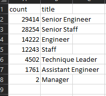
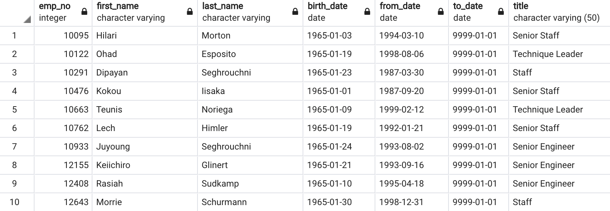
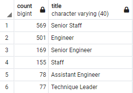
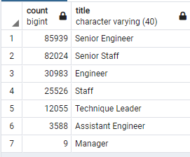

# Pewlett-Hackard Mentorship Analysis

## Overview of the analysis: 

There is a concern at Pewlett Hackard (PH) that there are going to be many retiring employees in the upcoming years. A preliminary analysis has shown that many current employees are reaching retirement age. Based on this knowledge, PH now wants to know two things:

1. What the number of retiring employees per title - current employees born between Jan 1st, 1952 and Dec 31st, 1955

2. Identify employees who are eligible to participate in a mentorship program

## Results: 
Using PH's database of current employees with titles, and querying for those that were of retirement-age, the following result is displayed below:

### Figure 1 - Number of Retiring employees per title
</img>

As for those that were eligible for the mentorship, the criteria given was were those that were born between January 1, 1965 and December 31, 1965. The first 10 lines of results are shown here:

### Figure 2 - Sample of Eligible Employees for Mentorship
</img>

From this analysis we can conclude the following:

- 90398 total employees will be of retiring-age
- Top 3 positions which are retiring: Senior Engineer, Senior Staff, Engineer 
- The Manager position has the lowest amount of employees retiring
- 1549 eligible employees for the mentorship program

## Summary: 

From this analysis, a few questions come up:
- why are there so little managers retiring?
    - check to see the distribution of current employees by title
    - count of title for the current employee table
- what are the current tiles of those that are part of the mentorship program?
    - count of mentorship table by title

For those that are eligible for mentorship, out of 1549 eligible employees another query was done to show the distribution of their current positions:
### Figure 3 - Mentor Eligible Employees and their Current Titles
</img>

We can refer back to [Figure 1](#Figure-1---Number-of-Retiring-employees-per-title), and in comparing it to the above distribution, we can conclude that there is definitely not enough mentor-eligible employees in the company to fill the roles of those leaving for retirement. Considering that only 1549 employees are eligible for the mentorship program, while 90,398 employees positions will be vacant soon, 88,849 employees will need to be hired to fill the remaining positions if all positions need to be replaced. This does not include positions left by those taking the mentorship. These two facts would suggest that the criteria for eligible mentors could be broadened, or PH will have to heavily rely on outside hires to fill in the roles left by the "silver tsunami" 

Aside from the manager title, there are enough qualified retirement-ready employees to mentor the next generation of PH employees. To see why managers numbers are so low, a couple of quick queries were done to check and see how many managers there are in total that are currently at PH. 

### Figure 4 - Count of Current Employees Current Titles
</img>

This query shows that in total of all the company, only 9 employees are currently holding the title of Manager. Whether this is an error in the source data, or is the current structure of the company, there will be issues in trying to fill this position even if we were stay with the current mentorship criteria.
